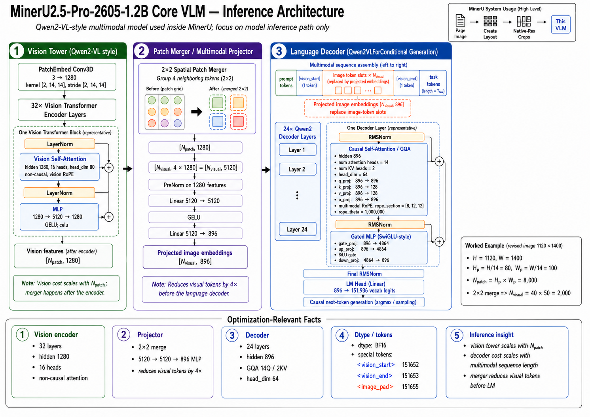
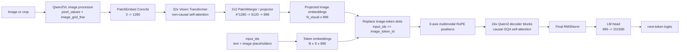

# MinerU2.5-Pro-2605-1.2B Core VLM Inference Architecture Notes

This note explains the **core VLM inference path** for `opendatalab/MinerU2.5-Pro-2605-1.2B`. It focuses on the model used inside MinerU and intentionally separates that model from full MinerU page parsing, layout postprocessing, Markdown/JSON assembly, file conversion, and application-level service code.

Reference diagram:



The important high-level point is that MinerU2.5-Pro uses a compact **Qwen2-VL-style decoder-only multimodal model**:

```text
Qwen2VLForConditionalGeneration
├── visual:          Qwen2VisionTransformerPretrainedModel
│   ├── PatchEmbed:  Conv3d(3 -> 1280, kernel/stride [2, 14, 14])
│   ├── 32x vision transformer blocks
│   └── PatchMerger: 2x2 spatial merge, 5120 -> 5120 -> 896
├── language_model:  Qwen2VLTextModel, decoder-only causal LM
└── lm_head:         Linear(896 -> 151936)
```

It is **not an encoder-decoder model with cross-attention**. Visual features are computed by the Qwen2-VL vision tower, projected into the language hidden size, and then replace `<|image_pad|>` token embeddings inside one causal decoder sequence.

---

## 1. Source-grounded configuration snapshot

Default checkpoint for this project:

```text
opendatalab/MinerU2.5-Pro-2605-1.2B
```

The 2604 and 2605 released configs have the same architecture. Treat 2605 as the newer checkpoint unless deliberately comparing releases.

### Top-level model config

| Field | Value | Meaning for inference |
|---|---:|---|
| `architectures` | `Qwen2VLForConditionalGeneration` | Transformers entry point |
| `model_type` | `qwen2_vl` | Standard Qwen2-VL implementation surface |
| `dtype` | `bfloat16` | Intended model dtype in config |
| `hidden_size` | `896` | Decoder hidden width, `D_lm` |
| `num_hidden_layers` | `24` | Decoder block count |
| `num_attention_heads` | `14` | Query heads in decoder attention |
| `num_key_value_heads` | `2` | GQA / grouped-query attention KV heads |
| Decoder head dim | `896 / 14 = 64` | Per-query-head width |
| `intermediate_size` | `4864` | Decoder gated MLP hidden width |
| `hidden_act` | `silu` | Decoder gated MLP activation |
| `vocab_size` | `151936` | LM head output dimension |
| `max_position_embeddings` | `32768` top-level, `8192` in text subconfig | Context limit fields in released config |
| `rope_theta` | `1000000` | RoPE frequency base |
| `mrope_section` | `[8, 12, 12]` | Multimodal RoPE split |
| `image_token_id` | `151655` | `<|image_pad|>` positions replaced by visual embeddings |
| `vision_start_token_id` | `151652` | `<|vision_start|>` |
| `vision_end_token_id` | `151653` | `<|vision_end|>` |
| `vision_token_id` | `151654` | `<|vision_pad|>` |
| `video_token_id` | `151656` | `<|video_pad|>` |

### Vision tower config

| Field | Value | Meaning for inference |
|---|---:|---|
| `vision_config.depth` | `32` | Vision transformer block count |
| `vision_config.embed_dim` | `1280` | Vision token width before merger |
| `vision_config.num_heads` | `16` | Vision attention heads |
| Vision head dim | `1280 / 16 = 80` | Per-head width |
| `vision_config.mlp_ratio` | `4` | Vision MLP hidden width is `5120` |
| `vision_config.hidden_act` | `quick_gelu` | Vision MLP activation |
| `vision_config.patch_size` | `14` | Spatial patch size |
| `vision_config.temporal_patch_size` | `2` | Qwen2-VL image/video temporal grouping |
| `vision_config.spatial_merge_size` | `2` | 2x2 merge before LM |
| `vision_config.hidden_size` | `896` | Output width after patch merger |

### Image processor defaults relevant to model-facing shapes

| Field | Value | Meaning |
|---|---:|---|
| `image_processor_type` | `Qwen2VLImageProcessor` | Standard Qwen2-VL dynamic-resolution processor |
| `min_pixels` | `50176` | Lower resize bound |
| `max_pixels` | `1605632` | Upper resize bound |
| `patch_size` | `14` | Spatial patch size |
| `temporal_patch_size` | `2` | Processor groups still images for Conv3d path |
| `merge_size` | `2` | Spatial dimensions aligned for 2x2 patch merger |
| `image_mean` | `[0.48145466, 0.4578275, 0.40821073]` | Normalization mean |
| `image_std` | `[0.26862954, 0.26130258, 0.27577711]` | Normalization std |

Since `patch_size * merge_size = 28`, valid resized image dimensions are aligned to the 28-pixel grid. Approximate post-merge visual-token budget:

```text
min visual tokens after merger ~= 50176   / (28 * 28) = 64
max visual tokens after merger ~= 1605632 / (28 * 28) = 2048
```

The **vision encoder itself attends over pre-merge patch tokens**, so its sequence length is roughly 4x the number of merged visual tokens.

---

## 2. End-to-end core model data flow



There are two inference phases:

1. **Prefill**: image processor, vision tower, patch merger, multimodal sequence assembly, and full decoder prefill.
2. **Autoregressive decode**: decoder-only generation using KV cache. Pixel values and vision features should not be recomputed after prefill.

---

## 3. Input tensors at the model boundary

For one or more images/crops, the model-facing tensors are usually:

| Tensor | Typical dtype | Shape | Notes |
|---|---|---:|---|
| `input_ids` | `torch.int64` | `[B, S]` | Chat/task tokens plus repeated `<|image_pad|>` placeholders |
| `attention_mask` | integer/bool-like | `[B, S]` | Used for causal decoder mask construction |
| `pixel_values` | model/processor float dtype | usually `[N_patch, 3, 2, 14, 14]` or flattened equivalent | Qwen2-VL processor output for Conv3d patch embed |
| `image_grid_thw` | `torch.int64` | `[num_images, 3]` | Per-image `(T, H_grid, W_grid)` patch grid |
| `position_ids` | generated internally if omitted | `[3, B, S]` | Multimodal position IDs for text and vision tokens |
| `past_key_values` | model dtype | per decoder layer | Used during decode after prefill |

The exact `pixel_values` rank can differ slightly by Transformers version and processor path, but conceptually it is a sequence of spatiotemporal patches consumed by the Qwen2-VL Conv3d patch embed.

---

## 4. Worked shape example

Assume a document crop/page is resized to:

```text
H_img = 1120
W_img = 1400
patch_size = 14
merge_size = 2
```

Both dimensions are multiples of 28, so the 2x2 merge is valid.

### Patch grid

```text
H_patch = H_img / 14 = 80
W_patch = W_img / 14 = 100
N_patch = H_patch * W_patch = 8000
```

For a still image, Qwen2-VL uses temporal patching internally, but the spatial patch-grid intuition is:

```text
vision encoder sequence: [N_patch, 1280] = [8000, 1280]
```

### Vision transformer

The 32 vision blocks preserve sequence length and width:

```text
[8000, 1280] -> 32x vision blocks -> [8000, 1280]
```

This is the most expensive vision step because non-causal attention scales with the pre-merge patch sequence length.

### Patch merger / projector

The 2x2 spatial merger groups four neighboring patch tokens:

```text
H_visual = H_patch / 2 = 40
W_visual = W_patch / 2 = 50
N_visual = 40 * 50 = 2000
```

The projector shape is:

```text
input after grouping: [N_visual, 4 * 1280] = [2000, 5120]
MLP:                  5120 -> 5120 -> 896
output:               [2000, 896]
```

The decoder sees **2000 visual embeddings**, not the 8000 pre-merge vision tokens.

---

## 5. Vision block details

Each of the 32 vision layers is a pre-norm non-causal transformer block:

```text
x
|
|-- LayerNorm(1280)
|    `-- Vision self-attention
|          qkv:  1280 -> 3840
|          heads: 16
|          head_dim: 80
|          non-causal attention
|          vision RoPE
|          proj: 1280 -> 1280
|
|-- residual add
|
|-- LayerNorm(1280)
|    `-- MLP
|          fc1: 1280 -> 5120
|          quick_gelu
|          fc2: 5120 -> 1280
|
`-- residual add
```

Optimization implication: even though the patch merger reduces visual tokens by 4x before the LM, the 32-layer vision tower pays attention cost on the **unmerged** patch sequence.

---

## 6. Patch merger details

The patch merger bridges the vision tower and language decoder:

```text
Input vision features:      [N_patch, 1280]
2x2 spatial grouping:       [N_patch / 4, 4 * 1280]
Grouped width:              5120
LayerNorm over context dim: 1280 before grouping in the Qwen2-VL implementation
Linear 1:                   5120 -> 5120
GELU
Linear 2:                   5120 -> 896
Output image embeddings:    [N_visual, 896]
```

The output width matches the decoder hidden size exactly.

---

## 7. Decoder block details

Each of the 24 decoder layers is a Qwen2-style pre-norm causal decoder block:

```text
x
|
|-- RMSNorm(896)
|    `-- Causal self-attention / GQA
|          q_proj: 896 -> 896   # 14 query heads * 64
|          k_proj: 896 -> 128   # 2 KV heads * 64
|          v_proj: 896 -> 128
|          o_proj: 896 -> 896
|          multimodal RoPE, section [8, 12, 12]
|
|-- residual add
|
|-- RMSNorm(896)
|    `-- Gated MLP / SwiGLU-style
|          gate_proj: 896 -> 4864
|          up_proj:   896 -> 4864
|          SiLU(gate) * up
|          down_proj: 4864 -> 896
|
`-- residual add
```

After the final decoder layer:

```text
Final RMSNorm
LM head: 896 -> 151936 logits
```

The LM head is wide relative to the hidden size because the Qwen2 tokenizer vocabulary is large.

---

## 8. Multimodal sequence assembly

The model uses Qwen2-VL-style chat/image special tokens. A conceptual input sequence looks like:

```text
<|im_start|> user
prompt / task instruction
<|vision_start|>
<|image_pad|> ... repeated N_visual times ...
<|vision_end|>
other task tokens
<|im_end|>
<|im_start|> assistant
```

The model first embeds all token IDs:

```text
input_ids -> embed_tokens -> inputs_embeds: [B, S, 896]
```

Then projected image embeddings replace the `<|image_pad|>` positions:

```text
inputs_embeds[input_ids == image_token_id] = image_embeds
```

After that, the decoder is just a causal LM over a multimodal prefix.

---

## 9. MinerUClient and system-level boundary

The official `mineru-vl-utils` package exposes `MinerUClient` APIs such as:

```text
two_step_extract(image)
layout_detect(image)
batch_layout_detect(images)
aio_layout_detect(image)
```

For this project, keep the distinction clear:

- Pure Transformers model runs are for understanding and optimizing the core VLM.
- `MinerUClient` is a reference for prompts, task routing, layout/content workflows, and output formatting.
- Full MinerU page parsing is a two-stage system: global layout on a page image, then native-resolution crop/content recognition.

Do not use a `MinerUClient` output as proof that the local model internals are optimized correctly unless the underlying model path and prompts are also inspected.

---

## 10. Rough parameter accounting

Config-derived approximate counts:

| Component | Approx params |
|---|---:|
| Tied token embedding / LM head | 136M |
| 24 decoder layers + final norm | 358M |
| Text side total with tied LM head | 494M |
| PatchEmbed Conv3d | 1.5M |
| 32 vision transformer layers | 629M |
| Patch merger / projector | 30.8M |
| Vision side total | 662M |
| Total with tied LM head | 1.16B |
| Total if LM head untied | 1.29B |

This matches the public `1.2B` model naming. The vision tower is the larger half of the model.

---

## 11. Optimization-relevant facts

1. **Vision tower is heavy.** It has 32 layers at hidden 1280 and attends over pre-merge patch tokens.
2. **Patch merger reduces decoder visual tokens by 4x.** This helps the LM but does not reduce vision encoder attention cost.
3. **Decoder is compact but still decode-critical.** It has 24 layers, hidden 896, GQA 14Q/2KV, and a 151936-wide LM head.
4. **Prefill and decode should be separated.** Vision and patch merger run only during prefill; autoregressive generation should reuse the decoder KV cache.
5. **MinerU system behavior is two-stage.** Real throughput depends on page layout calls plus many crop/content calls, not just one crop or one full page.
6. **BF16 is the config dtype.** Ascend 310P-class hardware may require fp16 or fp32 workarounds, so dtype must be tested rather than assumed.

---

## 12. Source pointers

- Latest model checkpoint: `opendatalab/MinerU2.5-Pro-2605-1.2B`
- Architecture-compatible prior checkpoint: `opendatalab/MinerU2.5-Pro-2604-1.2B`
- Config files to inspect first:
  - `config.json`
  - `preprocessor_config.json`
  - `tokenizer_config.json`
- MinerU VLM helper package: `opendatalab/mineru-vl-utils`
- Paper: `arXiv:2604.04771`
